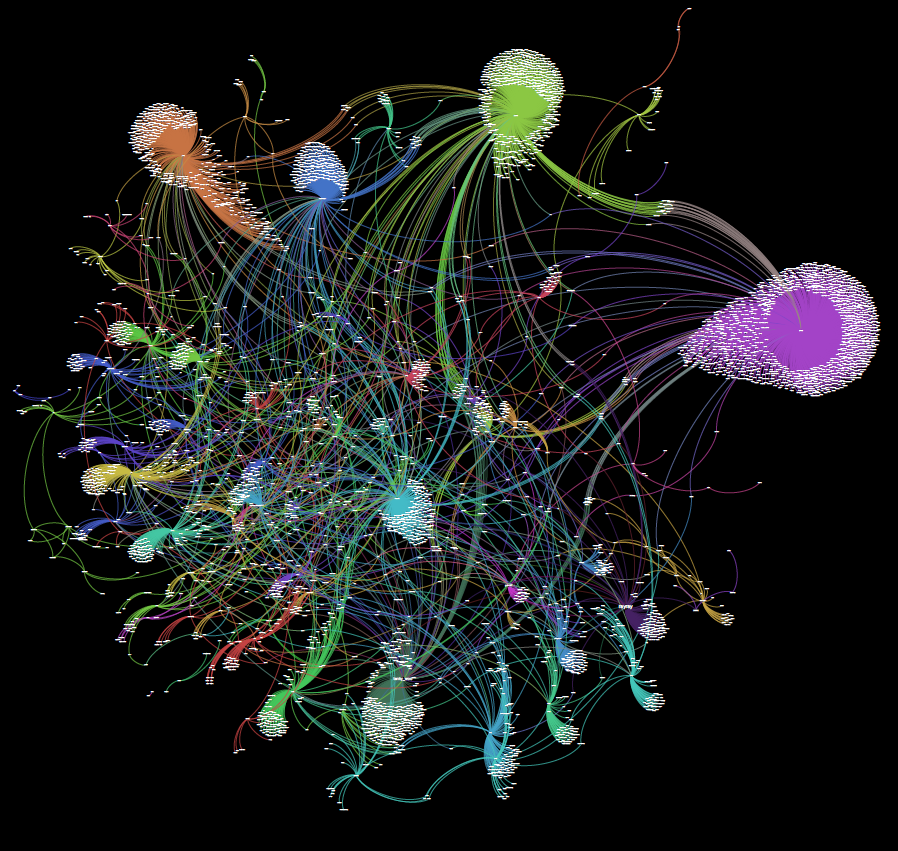

#Usage

**If you want to store the result into the format of json, just to do :**

```
$ scrapy crawl cnblog -o filename.json/filename.csv 
```

这个爬虫是用来爬博客园博客网站的用户的粉丝关系的。博客园有20多万用户，最后爬到了其中的18万用户的数据（保存在data.json文件里），剩余的未爬到的2-3万用户应该就是所谓的孤岛用户，即在前面那18万用户之间没有粉丝也没有别的粉丝。

该爬虫的用法的相关介绍可参见我写的一篇博客[scrapy爬取博客园粉丝关系](http://blog.csdn.net/u012176591/article/details/44899987).

爬到的数据格式如下：

>{"url": "http://home.cnblogs.com/u/jinliangjiuzhuang/", "followers": [], "name": "jinliangjiuzhuang"},
>
>{"url": "http://home.cnblogs.com/u/Gavin_Liu/", "followers": ["445574", "Dillonn", "wait", "710309", "bo5509", "695644", "700304", "TonyHome", "614242", "631776", "526044", "jinliangjiuzhuang", "zxxz", "629608", "apprentice89", "365950", "AlgoWing", "ziziquanquan", "546099", "Hacker-zzm", "Tigerlee", "Sylla-Zhang", "bourneli", "diyunpeng", "lifeilong-here", "340663", "killian", "137534", "CathyGao", "junerain", "345979", "sunshineQu", "297485", "jianzhitanqiao", "171722", "bourbon", "alinly", "mamori", "zhanglx", "feiers", "291864", "bluedream2009", "codeyu", "wangxingny", "prime", "291569", "prinsipe", "juewuly", "tanky_woo"], "name": "Gavin_Liu"},
>
>{"url": "http://home.cnblogs.com/u/lmei/", "followers": ["lavin", "Tmc-Blog", "n1h1", "cm20121009", "xiaoafei1991", "kokoliu", "lovelp", "juefan", "wuday", "139651", "tfzxyinhao", "djangochina", "hefishart", "371927", "322242", "alinly", "blackice", "zssxfc", "kiner", "xiaopohou", "oran176", "gobacktomars", "Xbingbing"], "name": "lmei"}

每一行代表一个用户的数据,url项是其主页地址，followers项是其粉丝的用户名，name项是该用户的用户名。

下图是爬到的部分粉丝数据的可视化效果。图中每个点代表博客园上的一个博客用户，两点之间有连线表示两个用户之间有粉丝关系。可以看到图上有明显几个大小团簇，团簇的中心所代表用户的粉丝明显多于平均状况，这就是所谓的博客大牛：
<div  align="center">
 
</div>


